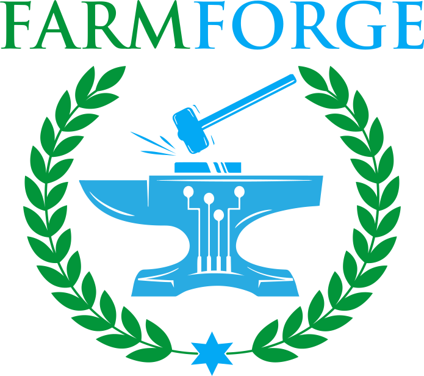

# FarmForge

FarmForge is a farm management system that can integrate with IoT devices with 
minimal effort.

FarmForge allows hobbyists, gardeners, and farmers to manage their gardens and 
farms by keeping track of their crops and inventory. It also enables you to 
connect FarmForge IoT devices for reporting, alerts, and more.

It's designed to be low-cost and configurable in order to meet each individual's
specific needs. The Priority and emphasis is to have it installed and working
via the local network, but it can be reached everywhere through the use of a 
cloud provider such as Azure.

# Features
- Location Management - Keep track of various locations that you can plant items
- Crop Management - Keep track of what and where you plant, what stage of growth 
a crop is in, and when you harvested. Find your average time to harvest and yields
- Inventory Management - Manage what product and inventory you have on hand.

# Installation, Getting Started, and Documentation
Check out the [Official documentation](https://farmforge.io/docs/farmforge/introduction) 
for detailed installation instructions on how to intall and get started. You can
also find documentation on the client, api, and more.

# Demo
Coming soon!

# Contact & Contributing
The easiest way to reach out is the [Discord](https://discord.gg/j5QMZUH) server. 
There are channels for general discussion, feature requests, issues, and ongoing 
development.

For those looking to activly participate or assist in development, there is 
plenty to do, including web & mobile (Flutter), api (.net core), embedded 
(c++ / c#), cloud, and even graphics or design.

Additional information coming soon!