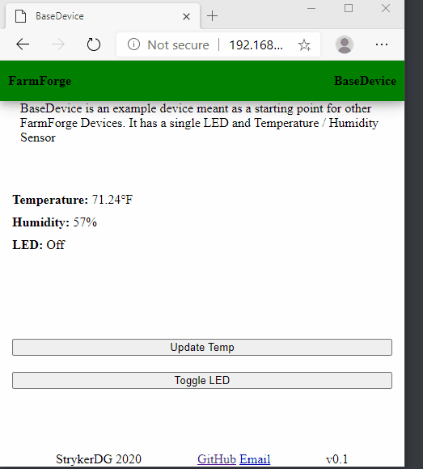

# Base Device
Base device is a tempate that can be used to help you build your own FarmForge Devices. It is a simple example that allows you to view a webpage and interact with it's interfaces (DHT11 and LED) by connecting to it directly, or by connecting to your local network



# Parts List
- (1) [KeyStudio 8266](https://www.amazon.com/KEYESTUDIO-ESP8266-Board-Arduino-Cable/dp/B07Q9HSRW3/)
- (1) [DHT 11](https://www.amazon.com/Temperature-Humidity-Sensor-Arduino-Raspberry/dp/B07T7ZR7MS/)
- (1) [LED](https://www.amazon.com/Colors%C3%97100pcs-Emitting-Assortment-Electronics-Components/dp/B07FKKN2TC/)

# Diagram
Coming Soon!

# Setup
1) Connect the board, DHT11, and LED as depicted in the diagram
2) modify private.h to specify your own SSID, PASSWORD, AP_SSID, AP_PASSWORD, OTA_HOSTNAME, OTA_PASSWORD, and TOKEN

```
// Network you're going to connect to
#define SSID <SSID>
#define PASSWORD <PASSWORD>

// Access Point settings
#define AP_SSID "<AP_SSID>"
#define AP_PASSWORD "<AP_PASSWORD>"

// Admin user
#define OTA_HOSTNAME "<HOST>"
#define OTA_PASSWORD "<PASSWORD>"
#define TOKEN "<TOKEN>"
```

3) Modify BaseDevice.h to specify your mDNS name and LED/DHT pins

```
#define DNS_NAME "basic_device"
#define LED 2
#define DHTPIN 4
```

4) Install the drivers and specify the board settings by following KeyStudio's [documentation](https://wiki.keyestudio.com/KS0367_keyestudio_ESP8266_WiFi_Board)
5) Install the Arduino IDE [plugin](https://github.com/esp8266/arduino-esp8266fs-plugin) to allow uploading files to SPIFFS
6) Upload the html, css, and js files to SPIFFS via Arduino IDE
7) Upload the sketch via Arduino IDE
8) Navigate to the mDNS name or IP address